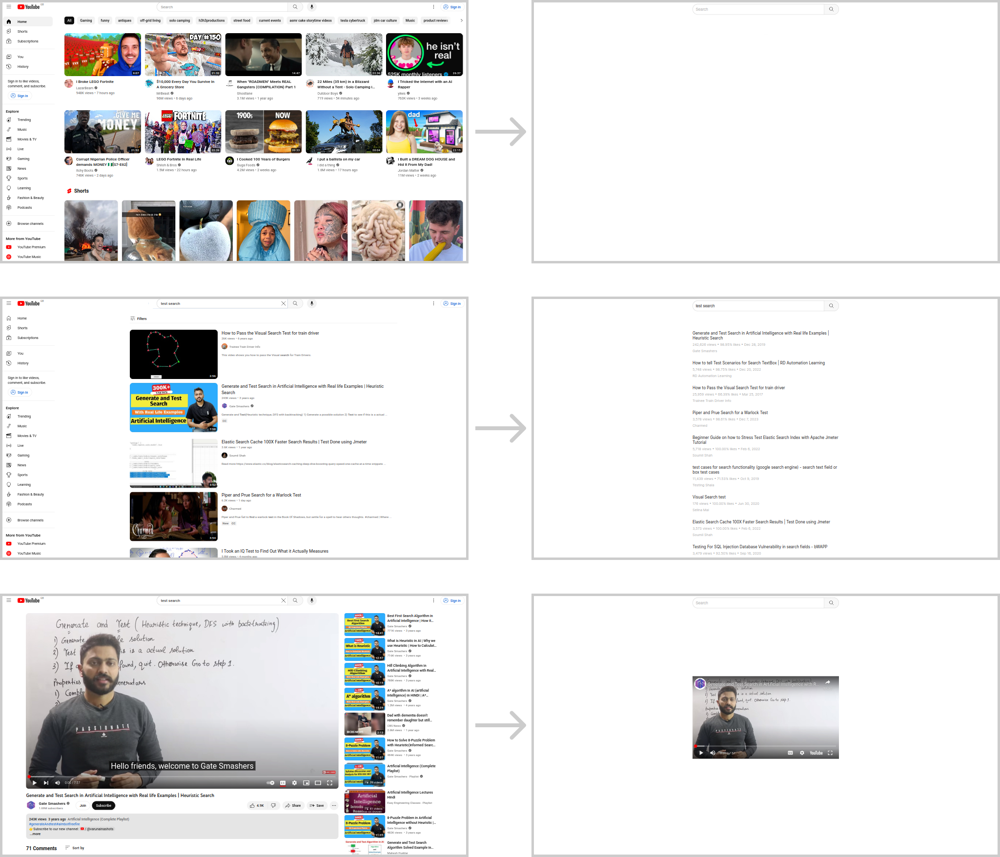

  <h1>Minimal YouTube Viewer</h1>

A YouTube Front-End that reduces unncessary elements to prevent distraction.

YouTube is a great source for education but their business model incentivizes the platform to keep you on as long as possible so that they can serve you more and more ads, profiting more and more from your attention. 

This is done by maximizing engagement with the platform, often by bombarding the user with unlimited optionality and outrageous content.

This Front-End seeks to remove the distraction so that you can use YouTube with more intentionality and reclaim your attention.

It works by using the [YouTube Data API](https://developers.google.com/youtube/v3) to return a list of search results for a given query and the [ReturnYoutubeDislike API](https://www.returnyoutubedislike.com/) for additional video statistics. Videos are then displayed by embedding the video with the selected ID on the page.

It is recommended that this is used with an ad block, such as [uBlock Origin](https://ublockorigin.com/).

There is purposefully no customization options, although any requests will be considered.

  

